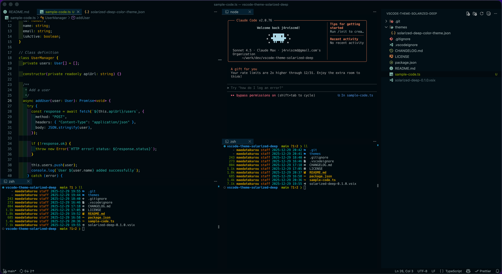

# Solarized Deep

[](LICENSE)
[](https://marketplace.visualstudio.com/items?itemName=j4rviscmd.solarized-deep)
[](https://marketplace.visualstudio.com/items?itemName=j4rviscmd.solarized-deep)
[](https://marketplace.visualstudio.com/items?itemName=j4rviscmd.solarized-deep)

A calmer, refined VSCode dark theme based on Solarized Dark, tuned to the Osaka palette.

## Screenshots



## Star this repo to keep me motivated ⭐

I build this in my spare time. Every star shows that my work is valued and keeps me going!


## Features

- **Calm Color Palette**: Eye-friendly colors optimized for extended coding sessions
- **Solarized Base**: Maintains the proven color hues of the Solarized color scheme
- **Comprehensive Syntax Highlighting**: Extensive token color definitions for major programming languages
- **Semantic Highlighting**: Full support for semantic token colors in TypeScript, JavaScript, and more

## Installation

### From VSCode Marketplace

1. Open VSCode
2. Open Extensions view (`Cmd+Shift+X` / `Ctrl+Shift+X`)
3. Search for "Solarized Deep"
4. Click Install

Or install directly from the [Visual Studio Marketplace](https://marketplace.visualstudio.com/items?itemName=j4rviscmd.solarized-deep)

### Local Development & Testing

```bash
# Clone the repository
git clone https://github.com/j4rviscmd/vscode-theme-solarized-deep.git
cd vscode-theme-solarized-deep

# Enable shared Git hooks (blocks direct pushes to main)
git config core.hooksPath .githooks

# Copy to VSCode extensions directory
cp -r . ~/.vscode/extensions/solarized-deep
# or
# command palette -> Start Debugging

# Restart VSCode
```

## Activating the Theme

1. Press `Cmd+K Cmd+T` (macOS) or `Ctrl+K Ctrl+T` (Windows/Linux)
2. Select **Solarized Deep** from the list

Or configure via settings:

```json
{
  "workbench.colorTheme": "Solarized Deep"
}
```

## Color Palette

Tuned to the Osaka palette:

- **Base**:
  - `#00141a` (background)
  - `#000E14` (title, status, and activity bars)
  - `#ADB8B8` (foreground)
  - `#002b36` (borders, selection, active tabs)
  - `#1A6265` (selection highlights)
- **Accent Colors** (Solarized):
  - Green: `#859900` (keywords)
  - Cyan: `#2aa198` (strings)
  - Blue: `#268bd2` (functions)
  - Yellow: `#b58900` (classes)
  - Orange: `#cb4b16` (constants)
  - Red: `#dc322f` (errors)

## License

MIT License

Copyright (c) 2025 j4rviscmd

See the [LICENSE](./LICENSE) file for details.
